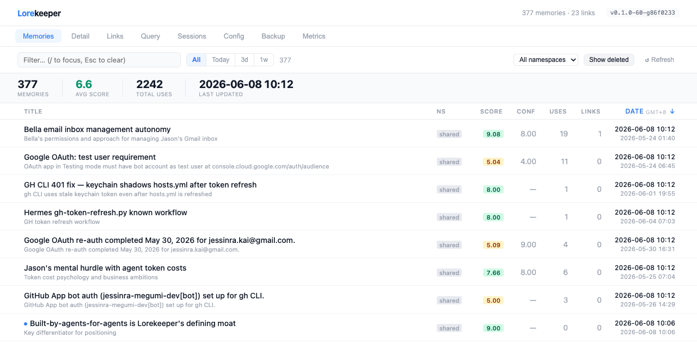
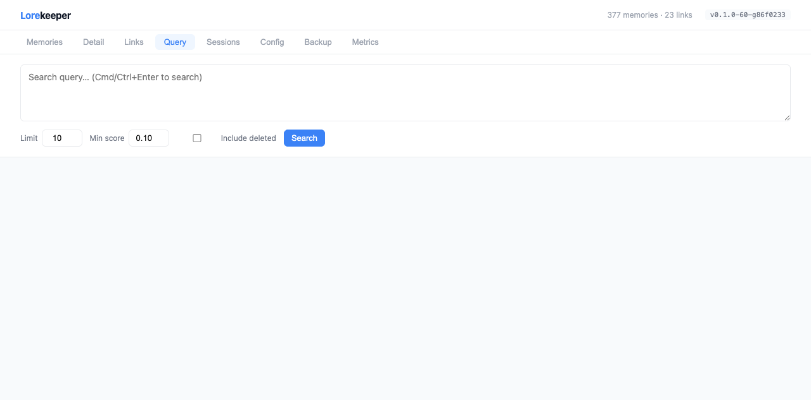

# Lorekeeper

> **Self-improving memory for AI agents. One command, no cloud, no config.**
>
> ```bash
> pip install lorekeeper-mcp && lorekeeper setup && lorekeeper
> ```
>
> Your agent remembers across sessions — and the memory gets **better, not just bigger.**
> Local. No API keys. No sign-up. **Free to run forever.**



---

## Why Lorekeeper

Every AI agent session starts blank. You re-explain context, re-state preferences, re-teach patterns — every single time.

Files like `CLAUDE.md` and `.cursorrules` help, but they're hand-maintained, can't search themselves, and grow stale. Cloud services work, but your session data leaves your machine and you're paying per API call. Libraries are powerful, but you're writing the integration yourself.

Lorekeeper is a different shape: **a local MCP server you `pip install` once.** It connects to your existing agents, stores memories in SQLite on your own disk, and starts improving with every session:

```
Agent uses a memory → rates it useful or not →
scores adjust automatically → weak memories decay →
strong memories surface more often → search gets sharper
```

A fresh install and a six-month-old install are **genuinely different products.** The longer you use it, the less noise you get — and the more your agents feel like they actually know your codebase.

---

## Quick Start

3 minutes, zero configuration:

```bash
# 1. Install
pip install lorekeeper-mcp

# 2. Configure your agents (auto-detects Hermes, Claude Code, Cursor)
lorekeeper setup

# 3. Start the MCP server
lorekeeper
```

`lorekeeper setup` scans for installed agents and injects the MCP entry, agent prompt, and bundled skills automatically. Use `--check` to preview without writing.

Then ask your agent:

> _"Remember that I prefer `curl -vX GET` for debugging endpoints."_

It calls `lore_remember` → memory stored. Next session:

> _"What's my preferred debug command?"_

It calls `lore_search` → memory retrieved. ✅

**Full walkthrough → [docs/quickstart.md](docs/quickstart.md)**

---

## Features

| What                    | How                                                                                                                           |
| ----------------------- | ----------------------------------------------------------------------------------------------------------------------------- |
| **Hybrid search**       | Semantic vectors + BM25 keyword + time-decay + usage frequency + memory score — all ranked by a weighted formula              |
| **Self-improving**      | `lore_update` feedback adjusts scores. Bad memories fade (<2 confidence + not useful → soft-delete). Good ones rise.          |
| **Auto-linking**        | New memories are automatically linked to their closest semantic neighbor. A lightweight knowledge graph forms without effort. |
| **Duplicate detection** | New inserts are checked against existing memories. Near-identical content is blocked (override with `force=true`).            |
| **Dashboard**           | Full web UI — browse, search, edit, delete. Seven tabs including backup/restore with dedup preview.                           |
| **Universal MCP**       | Works with Claude Code, Cursor, Hermes, Copilot, OpenCode — any MCP-compatible agent.                                         |
| **Local-first**         | Your data stays on your machine. SQLite + LanceDB (or ChromaDB). No cloud dependency, no API keys.                            |
| **Namespaces**          | Multiple agents share one store with isolated namespaces. Writes go to your namespace; reads include the shared pool.         |
| **Reflection**          | Agents auto-extract learnings from sessions. Discoveries and lessons become searchable memories.                              |

---

## Use Cases

### Staying in context across sessions

You set up your auth layer on Monday. Wednesday, a different agent starts fresh with no idea. With Lorekeeper, it already knows the middleware path, the token format, and which test covers the edge case — because you told it once.

```
"Remember that our JWT uses jose middleware in src/middleware/auth.ts
 and refresh tokens expire in 7 days."
→ lore_remember stores it
→ Every future session, on any agent: already in context
```

### One memory pool, multiple agents

Claude Code for review, Cursor for implementation, Hermes for planning — they shouldn't each start from zero. Lorekeeper namespaces let them share one store. One agent's discovery becomes every agent's knowledge.

```
→ Engineer agent notes a performance quirk in the search service
→ lore_remember stores it under the shared namespace
→ PM agent surfaces it during sprint planning
→ No briefing, no copy-paste
```

### Cross-session debugging

You fixed a subtle CORS bug three weeks ago and your agent helped. Neither of you remembers the details.

```
"What did we figure out about the CORS issue?"
→ lore_search returns the root cause, the fix, and the context around it
```

### Project onboarding

New repo, new agent session. Instead of re-explaining the architecture, you run a few `lore_remember` calls after the first session. The next session — and every agent after it — starts with the right foundation.

```
"Remember: the payment service requires X-Idempotency-Key on all POST requests."
→ Claude Code, Cursor, and Codex all read from the same store
```

---

## Who It's For

**You, if you use:**

- Claude Code and want it to remember project context between sessions
- Cursor and want persistent agent memory
- Hermes, OpenCode, Codex CLI, Copilot CLI, or any MCP-compatible agent
- Multiple agents and want them to share knowledge

**Not for you yet, if:**

- You need team RBAC, audit logs, or SSO (coming post-beta)
- You're building a consumer AI app (we're agent-first, not API-first)
- You don't use AI coding agents (Lorekeeper is an MCP tool)

---

## How It Compares

There are great tools in this space — each makes different trade-offs. Here's where Lorekeeper sits:

|                     | File-based | Cloud services         | Docker servers   | Library (Mem0)         | agentmemory (Node) | **Lorekeeper**                          |
| ------------------- | ---------- | ---------------------- | ---------------- | ---------------------- | ------------------ | --------------------------------------- |
| **Setup**           | Built-in   | API key + cloud config | `docker compose` | Write integration code | `npx agentmemory`  | **`pip install`**                       |
| **Data**            | Local      | Cloud                  | Local            | Your call              | Local              | **Local**                               |
| **Search**          | grep       | Vector                 | Vector           | Vector                 | Hybrid             | **Hybrid + time-decay + usage + score** |
| **Self-improving**  | ❌         | ❌                     | ❌               | ❌                     | ❌                 | **✅ Quality loop**                     |
| **Knowledge graph** | ❌         | Paid                   | ❌               | Paid                   | ❌                 | **✅ Free auto-link**                   |
| **Dashboard**       | ❌         | ✅                     | ❌               | ❌                     | Viewer             | **✅ Full web UI**                      |
| **Dependencies**    | None       | ~300MB                 | ~2GB             | ~1.4GB                 | ~200MB             | **~1.4GB** (embeddings)                 |
| **Built by agents** | ❌         | ❌                     | ❌               | ❌                     | ❌                 | **✅ Dogfooded daily**                  |

Cloud services and Docker-based solutions are strong choices for teams or production apps. Lorekeeper is optimised for the other end: solo developers and agent workflows where **zero ops, zero cloud, and a self-improving store** matter most.

> **Dependency note:** ~1.4GB is from the sentence-transformers embedding model (PyTorch). This is the same weight class as any local embedding solution. We're honest about it.

---

## MCP Tools

Lorekeeper exposes **8 MCP tools** covering the full memory lifecycle:

| Tool                      | Purpose                                                  |
| ------------------------- | -------------------------------------------------------- |
| `lore_search`             | Hybrid semantic + keyword search with relevance scores   |
| `lore_remember`           | Fast one-shot memory save (auto-titles, auto-links)      |
| `lore_insert`             | Bulk structured insert with custom scores and links      |
| `lore_update`             | Feedback loop — rate memories, drive quality             |
| `lore_forget`             | Soft-delete wrong or outdated memories                   |
| `lore_reflect`            | End-of-session: extract learnings, auto-save discoveries |
| `lore_processed_sessions` | Check which sessions are already processed               |
| `lore_recommend_links`    | Suggest candidate links between related memories         |

### `lore_search`

```json
{
  "query": "checkout payment flow",
  "min_score": 0.1,
  "include_links": true,
  "include_deleted": false,
  "refine_from": null,
  "format": "full",
  "ids": null
}
```

Returns ranked memories with relevance scores and linked memories.

Two search modes:

**Query mode** (default) — runs the hybrid semantic + BM25 pipeline. Parameters:

- `query` (required unless `ids` is set): search text
- `min_score` (default `0.1`): minimum `combined_score` threshold
- `refine_from`: pass a list of `lore_id` strings from a previous search result to re-rank only within that candidate set using a new query. Unknown IDs are silently ignored. Max 200 IDs (configurable via `LORE_MAX_REFINE_FROM_IDS`)
- `format`: `"full"` (default) returns complete memory objects with relevance scores; `"title"` returns compact `{id, title, score}` dicts for lower token cost

**ID lookup mode** — when `ids` is set, skips the vector/BM25 pipeline entirely and fetches those specific `lore_id`s directly from SQL. Unknown IDs are silently ignored. `query` is ignored in this path. Max 50 IDs (configurable via `LORE_MAX_SEARCH_IDS`). Pair `ids` with `format='title'` for a two-step workflow: list titles first, then fetch full objects for specific IDs.

Other params: `limit` (max results, defaults to `LORE_SEARCH_LIMIT`), `include_links` (default `true`; forced off in `format='title'` mode), `include_deleted` (default `false`).

### `lore_insert`

```json
{
  "memories": [
    {
      "title": "Mutable default args in Python",
      "description": "def f(x=[]) shares the list across all calls — use None instead.",
      "content": "..."
    },
    {
      "title": "Token refresh interval",
      "content": "Access tokens expire after 1h.",
      "links": [
        {
          "target_memory_id": "<target-uuid>",
          "relation_type": "related_to",
          "reason": "part of OAuth flow"
        }
      ]
    }
  ],
  "links": [
    {
      "source_memory_id": "<uuid>",
      "target_memory_id": "<uuid>",
      "relation_type": "related_to",
      "reason": "Both about Python gotchas"
    }
  ],
  "force": false
}
```

Each memory dict may include:

- `title` (required): short unique label
- `content` (optional): the full text to store
- `description` (optional): brief summary
- `score` (optional, default 5.0): initial quality score 0–10
- `links` (optional): inline links to create after insert. Each link: `{target_memory_id (required), relation_type (required), reason? (optional)}`

Top-level `links` (linking existing memories to each other) and per-memory inline `links` can be used together in a single call.

Duplicate detection runs automatically. Before inserting, the server computes a dedup score (`0.6·semantic + 0.4·keyword`). If it meets or exceeds `LORE_DUPLICATE_THRESHOLD` (default 0.85), the insert is blocked and the existing memory is returned. Use `force: true` to override.

### `lore_remember`

```json
{
  "thought": "Hybrid search formula: 0.45 semantic + 0.30 keyword + 0.15 score + 0.10 usage"
}
```

Fast one-shot memory insert — zero friction. Pass a thought as a single string; the server auto-extracts the title (first ~80 chars, sentence boundary), stores the full content verbatim with a default score of 7.0, and auto-links to the nearest semantic neighbor if similarity ≥ 0.75. Returns `{id, title, linked_to: {id, score} | null}`. Uses the same dedup pipeline as `lore_insert` — exact title matches are definitive duplicates.

Use this for quick capture. Use `lore_insert` when you need explicit titles, descriptions, scores, or manual links.

### `lore_update`

```json
{
  "memory_feedback": [{ "id": "<uuid>", "useful": true, "confidence": 8 }],
  "link_feedback": [{ "id": "<uuid>", "useful": false }]
}
```

Drives the quality signal loop. Call this after every `lore_search` to keep scores calibrated.

### `lore_forget`

```json
{
  "memory_ids": ["uuid1", "uuid2"],
  "reason": "hallucinated"
}
```

Immediately soft-deletes one or more memories. Use when a memory is wrong, duplicated, or outdated and you don't want it polluting future searches. The memory is excluded from `lore_search` results after this call.

`reason` must be one of: `duplicate`, `hallucinated`, `outdated`, `expired`, `unspecified`. Logged for auditability. Soft-delete is reversible at the DB level, but no undelete tool is exposed.

Returns `{ "forgotten": [...], "not_found": [...], "errors": [...] }`.

### `lore_reflect`

```json
{
  "session_id": "uuid1",
  "summary": "Implemented reflect integration; extracted 3 lessons.",
  "session_date": "2026-05-19",
  "topic": "reflect-integration",
  "task_type": "build",
  "what_was_done": "Built the reflect integration...",
  "decisions": "- Used single-session submit for context efficiency",
  "lessons_learnt": ["Don't skip dedup check before inserting"],
  "good_patterns": ["Parallelise independent API calls"],
  "factual_discoveries": ["BM25 rebuild costs ~10ms at 5k memories"],
  "memory_ids": ["uuid-a", "uuid-b"],
  "auto_insert": true
}
```

Marks one session as processed and stores its content in the dashboard Sessions tab. Call once per session — reflect, submit, then move to the next.

**Auto-insert (default `auto_insert=true`):** Each item in `factual_discoveries` and `lessons_learnt` is automatically inserted as a standalone searchable memory. Discoveries get score 7.0, lessons get score 8.0. Duplicate-guarded — items already in the store return the existing ID with `"status": "duplicate"`; newly inserted items have `"status": "inserted"`. Pass `auto_insert=false` to store only in the reflection record without creating memories.

**Idempotency:** If `session_id` was already processed, returns immediately with `"already_processed": true` and `"memories_created": []`. The `[]` reflects the current call only — the original call's auto-inserts are not reconstructed. Check `already_processed` to detect retries.

Returns:

```json
{
  "reflection_id": "...",
  "session_id": "...",
  "created_at": "...",
  "memories_created": [
    {
      "id": "m-1",
      "title": "BM25 rebuild costs ~10ms...",
      "relation": "discovered_in",
      "status": "inserted"
    },
    {
      "id": "m-2",
      "title": "Don't skip dedup check...",
      "relation": "learned_in",
      "status": "inserted"
    }
  ]
}
```

### `lore_processed_sessions`

No parameters. Returns all session IDs already marked as processed by `lore_reflect`.

```json
{}
```

Returns:

```json
{ "processed_session_ids": ["session-uuid-1", "session-uuid-2"] }
```

Use this to avoid re-processing sessions — check the list before calling `lore_reflect`.

### `lore_recommend_links`

```json
{
  "lore_id": "<uuid>",
  "top_k": 10
}
```

Suggests link candidates between a memory and related memories in the store. Single-stage scoring pipeline — semantic cosine, BM25, entity overlap, and temporal proximity combined into a weighted score. The agent evaluates the candidates and decides which links to create.

**Does NOT write any links.** Returns candidates for review — confirm by calling `lore_insert` with `links=[]`.

Parameters:

- `lore_id` (required): source memory to find candidates for
- `top_k` (optional, default from `LORE_LINK_TOP_M`): max candidates to return, overriding the default limit

Returns:

```json
{
  "candidates": [
    {
      "source_lore_id": "<uuid>",
      "target_lore_id": "<uuid>",
      "weighted_score": 0.65,
      "scores": {
        "cosine": 0.82,
        "bm25": 0.45,
        "entity": 0.0,
        "temporal": 0.0
      }
    }
  ],
  "count": 10,
  "source_lore_id": "<uuid>"
}
```

Per-signal `scores` lets the agent make its own judgment about which candidates are worth linking — no LLM call inside Lorekeeper.

---

## Performance

> 📊 **Benchmark results from LKPR-70 coming soon.** Lorekeeper is being benchmarked against agentmemory's published evaluation suite — retrieval precision, context token savings, and search latency at scale. Results will be published here once complete.

Early internal numbers on a 1,000-memory store:

- **Search latency:** ~40–80ms (hybrid pipeline, LanceDB backend)
- **Duplicate detection:** ~30ms per insert (0.6·semantic + 0.4·keyword threshold)
- **BM25 index rebuild:** ~10ms at 5k memories

_Full benchmark methodology and reproducible script → [LKPR-70](https://github.com/Jessinra/Lorekeeper/issues/162)_

---

## Dashboard

A local web UI to browse, search, edit, and manage your memory store.

```bash
lorekeeper-dashboard
# → http://127.0.0.1:7777
```

Seven tabs:

| Tab          | What it does                                                             |
| ------------ | ------------------------------------------------------------------------ |
| **Memories** | Sortable table with live filter — title, score, confidence, usage, dates |
| **Detail**   | Edit a memory's content, manage its links, soft-delete or hard-delete    |
| **Links**    | Browse the knowledge graph — source → relation → target                  |
| **Query**    | Ad-hoc semantic + keyword searches with per-result score breakdown       |
| **Sessions** | All processed agent sessions with extracted learnings                    |
| **Config**   | Live tuning of search weights, quality thresholds, limits                |
| **Backup**   | Export/import memories as JSON with dedup preview                        |



---

## Built by Agents, For Agents

Lorekeeper is developed _using_ AI agents — Claude Code, Hermes, and our own agent team. The development cycle is itself a working demo of what it does:

```
agent builds a feature → uses Lorekeeper to capture what it learned →
searches those memories next session →
builds the next feature with the context already there
```

This isn't a marketing line. Every tool schema, return type, and workflow in Lorekeeper was shaped by agents using it daily — not by humans reading specs. When something was annoying to use, we changed it. When search returned noise, we tuned the weights. The product is what it is because the agents that build it depend on it.

> The agentic development loop documented in this repo is how we actually work — and it's what Lorekeeper is designed to support for you.

---

## Setup (Git clone)

If you prefer to clone the repo instead of pip install (e.g., for development):

```bash
git clone https://github.com/Jessinra/Lorekeeper.git
cd Lorekeeper
bash scripts/setup.sh
```

The setup script:

1. Installs dependencies with `uv sync`
2. Creates `~/.lorekeeper/` data directory
3. Installs git hooks (lint + tests enforced on commit)
4. Registers MCP config in detected agents (Claude Code, Cursor, Hermes)
5. Installs 5 agent skills for automatic memory workflows

**Prerequisites:** Python 3.11+, `uv` (or pip)

---

## Development

```bash
# Unit tests (fast — excludes E2E)
uv run pytest

# E2E dashboard tests (requires Playwright — ~30s, runs a live browser)
uv run playwright install chromium  # one-time
uv run pytest tests/e2e/ -m e2e

# Lint
uv run ruff check src tests

# Dashboard dev
uv sync --extra dashboard
uv run lorekeeper-dashboard

# Type check (before push)
uv run mypy src
```

Full development guide → `README.md` **Development** section (below).

---

## Project Layout

```
src/lorekeeper/
├── __main__.py          # Entrypoint — init_service() + mcp.run(stdio)
├── server.py            # FastMCP tool definitions (8 tools)
├── config.py            # Settings (pydantic-settings, LORE_ prefix)
├── models.py            # Pydantic models
├── dashboard/           # Web UI (FastAPI + uvicorn)
└── services/
    ├── orchestrator.py  # MemoryService — coordinates all sub-services
    ├── memory_engine.py # Vector store abstraction
    ├── lancedb_engine.py# LanceDB backend
    ├── chromadb_engine.py# ChromaDB backend
    ├── link_store.py    # SQLite — memories, links, reflections
    ├── keyword_index.py # BM25 index
    ├── search.py        # Hybrid ranking
    ├── dedup.py         # Duplicate detection
    ├── feedback.py      # Score delta, EMA, soft-delete
    ├── link_candidate.py# Link candidate pipeline
    └── relation_classifier.py # LLM-based relation classifier
```

---

## License

Apache-2.0 — see [LICENSE](LICENSE).

---

_Built by agents, for agents. [Manifesto](docs/manifesto.md) · [Strategy](docs/positioning-manifesto.md)_
