# Lorekeeper Dashboard — v7 Design Spec (FE/BE Handoff)

Source of truth: `v7 - opus/*.dc.html` (9 screens — Home, Memories, Graph, Query, Review, Sessions, Metrics, Settings, Command Palette). This document reverse-engineers those mockups into an implementation-ready spec: page structure, a reusable component library, interaction rules, an inferred data model, and a punch list of gaps to resolve with product before or during build.

**How to use this doc:** implement in the order given in [Suggested build sequence](#suggested-build-sequence). Section 2 (components) and Section 4 (cross-cutting interaction rules) apply to every page — read those first regardless of which page you're assigned. Section 6 lists every open question found while reverse-engineering the mockups; resolve the ones that block your page before writing code, not after.

**About the visual guides:** the images in `visuals/*.png` are actual screenshots of the v7 `.dc.html` mockups rendered in a real browser (Chromium, JavaScript executed), not redrawn approximations — so they are faithful to the real layout, colors, and content. Each page section embeds its screenshot; Section 2 embeds screenshots of the interactive components (detail drawers, confirm dialog, graph view) captured in the states you can't see in a default page load. The prose remains the source of truth for exact copy, thresholds, and behavior.

---

## 1. Global Shell

Every page shares the same frame: a fixed left nav rail, a sticky top bar, and a page body. Drawers, dialogs, toasts, and the command palette float above this frame from any page.

### 1.1 Layout skeleton

```
┌────┬─────────────────────────────────────────────┐
│    │  Top bar (60px): breadcrumb        [⌘K search]│
│Nav │─────────────────────────────────────────────│
│76px│                                               │
│    │              Page content                    │
│    │                                               │
└────┴─────────────────────────────────────────────┘
```

- Nav rail: fixed, `76px` wide, full viewport height, white, right border.
- Top bar: `60px`, sticky to top, white, bottom border, `z-index` above page content.
- Page content: left-margin `76px` to clear the rail; per-page max-widths vary (see each page section).

### 1.2 Nav rail — content and states

Top to bottom:

1. Brand mark — 36×36 rounded-square, brand purple, shield glyph.
2. Primary destinations, icon-over-label buttons (58px wide, ~10.5px label):
   - Home
   - Memories
   - **Links** (graph/relationship view)
   - **Query** (relevance/debug tool)
   - Review (badge: unread/pending count, red circle)
   - Sessions
   - Metrics
3. Spacer (flex-fill)
4. Settings (pinned to bottom) + a small green status dot (system health OK)

Active item: light-purple background (`#f1edff`), purple text/icon (`#7c5cff`), bold label. Hover (inactive): light-gray background.

> **⚠ Build note:** the mockups are inconsistent about this list — see [6.1](#61-nav-rail-inconsistencies). Treat the 7-item list above as the target; do not copy any single mockup file's nav verbatim.

### 1.3 Top bar

- Left: breadcrumb, muted `Lorekeeper / ` + bold current page name.
- Right: a button styled like a disabled search input — placeholder "Search or jump to…", leading search icon, trailing `⌘` `K` kbd hints. Clicking it (or pressing `⌘K`/`Ctrl+K` from anywhere) opens the **Command Palette** (Section 2.9).

---

## 2. Reusable Component Library

Build these once, share everywhere. Each entry lists where it's used so you can validate against multiple pages at once. The static components (tables, chips, pills, stat tiles, heatmaps) are visible in the page screenshots in Section 3; the interactive ones that only appear on demand are shown below, captured from the live mockups:

Memory Detail Drawer — view mode (left) and edit mode with the Danger Zone (right):

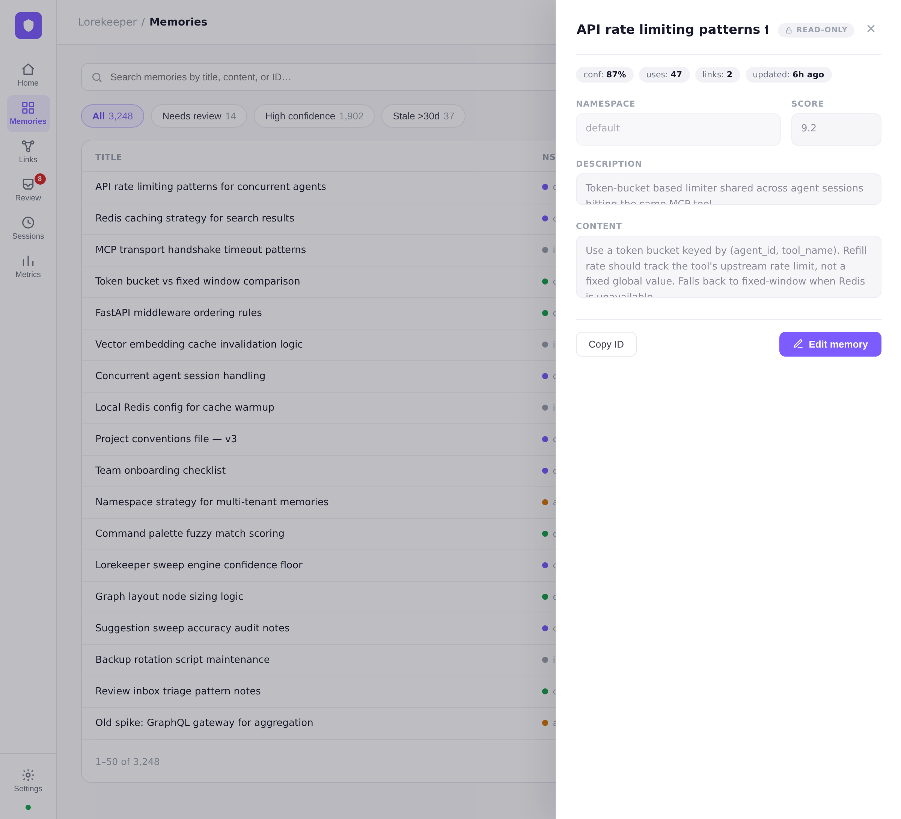

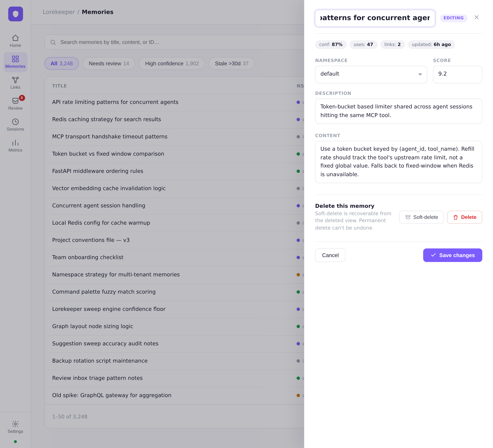

Confirm Dialog (hard-delete) and the Relationship Detail Drawer (suggestion, from Review):

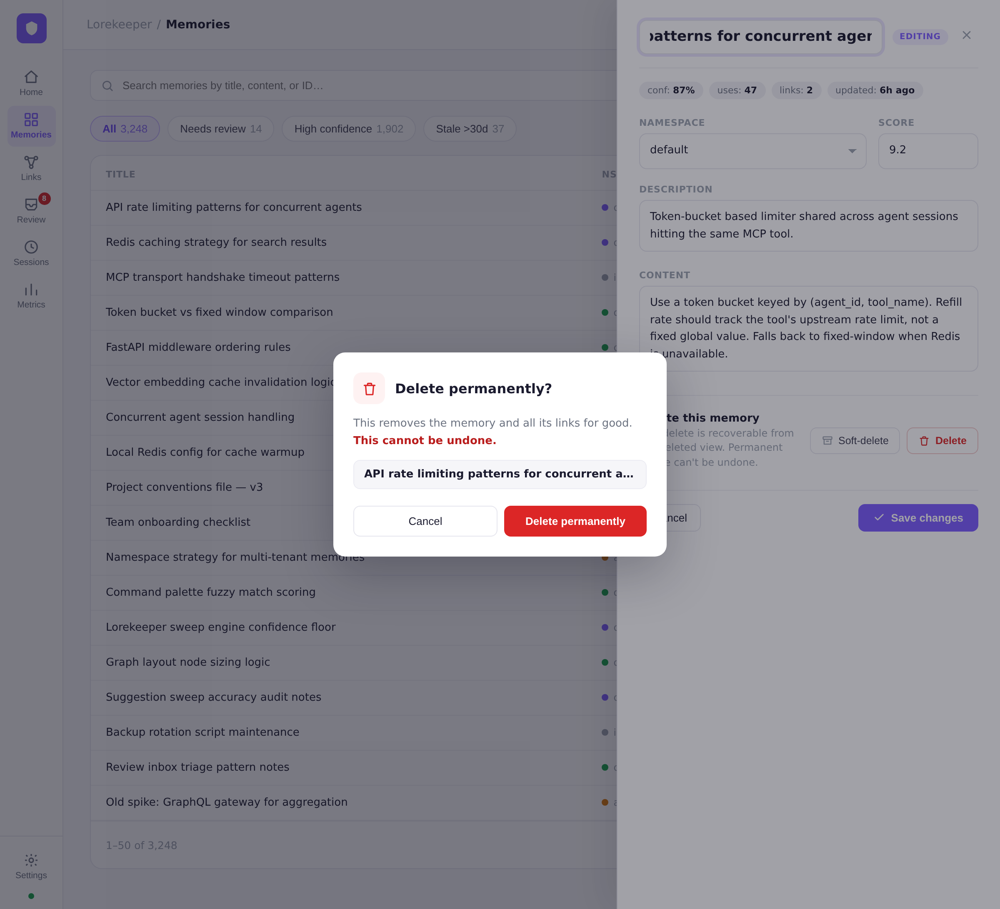

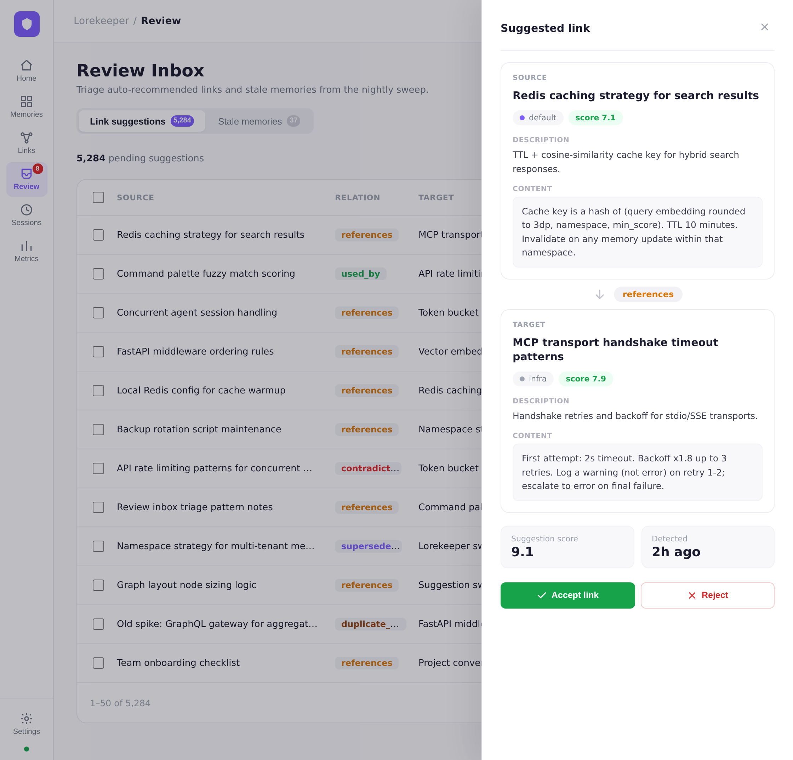

Graph view with a node selected — connected nodes highlighted, everything else dimmed, side panel listing direct connections:

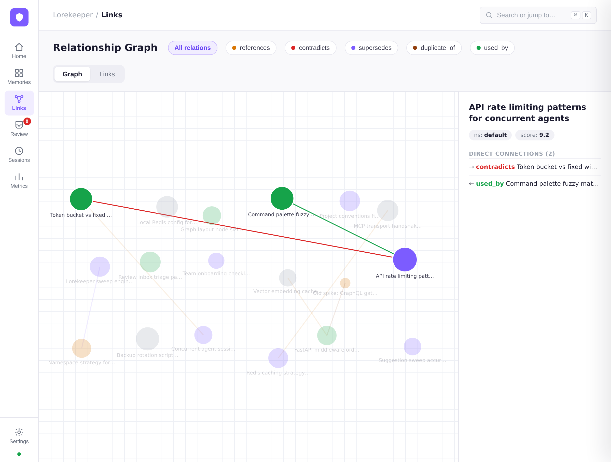

### 2.1 Data table

**Used in:** Memories, Links (table view), Review (both tabs).

- Header cells: uppercase, 11px, muted; sortable columns show an ascending/descending indicator only on the active column, and the header label turns accent-purple when active.
- Click a header → sorts by that column; click again → reverses direction. Default direction on first click is descending for numeric columns (score, uses, updated) and ascending for text columns (title, namespace, relation).
- Row hover → light background tint. Row click → opens the relevant **Detail Drawer** (2.5).
- Any inline action button inside a row (accept/reject/delete/refresh) must call `stopPropagation()` so it doesn't also trigger the row-click-to-open-drawer behavior.
- Optional leading checkbox column for bulk select (Review only) — see 2.6.
- Score/confidence values render via the **Score Pill** rule (2.3). Namespace values render via the **Namespace Dot** (2.4).
- Footer pagination bar: "Showing X–Y of Z", 50 rows/page, prev/next chevrons (disabled + greyed at first/last page), "Page N of M" centered.

> **⚠ Build note:** in the mockups only page 1 of every table is populated with real rows — page 2+ navigation updates the range label but not the row data. This is a prototype shortcut, not a spec: implement true server-side (or at minimum client-cached, correctly-paged) pagination. See [6.3](#63-pagination-contract).

### 2.2 Detail Drawer

Two distinct flavors — do not merge them, they have different footers and different content shapes.

**A. Memory Detail Drawer (view ⇄ edit)** — used on **Memories** (primary) and **Sessions** (a memory opened from inside a session's memory list). This is the same component in both places; build it once and mount it from either page.

- Slides in from the right (~440–460px, capped at ~92vw), backed by a dimmed click-to-close scrim.
- Header: title — plain text look in view mode, becomes a bordered editable input in edit mode — plus a "Read-only" or "Editing" status badge, plus a close (✕) button.
- Meta row (always read-only, both modes): confidence %, uses, links, updated-ago, shown as small pill chips.
- Body fields: Namespace (select), Score (number, 0–10, step 0.1), Description (textarea), Content (textarea). In view mode these render disabled/greyed; in edit mode they become bordered, focusable, with a purple focus ring. Textareas autosize to content.
- Danger zone (edit mode only): "Soft-delete" (secondary button, acts immediately + toast, recoverable) and "Delete" (destructive, opens the **Confirm Dialog**, permanent).
- Footer swaps by mode:
  - View: `Copy ID` (left) … `Edit memory` (right, primary).
  - Edit: `Cancel` (left, discards changes and reverts to view) … `Save changes` (right, primary).

**B. Relationship Detail Drawer (read-only)** — used on **Links** ("Link details") and **Review** (both "Suggested link" and stale "Memory details" variants). Shows one or two memory "cards" (role label, title, namespace + score chips, description, content-in-a-box) joined by a relation pill with a directional arrow, plus a small stat row, plus context-specific primary actions:

- Links page → single "Delete this link" button (destructive, confirms via Confirm Dialog). Deleting a link never deletes the memories it connects.
- Review → Suggestions tab → "Accept link" (green) / "Reject" (red), side by side, **no confirmation required**.
- Review → Stale tab → "Refresh" (mark used today) / "Delete" (destructive) — see the inconsistency flagged in [6.6](#66-inconsistent-confirmation-on-stale-delete).

> **Drawer stacking:** the Sessions page can have the Session drawer open, and opening a memory from inside it layers the Memory drawer on top (higher z-index, its own scrim). Preserve this stacking order — closing the top drawer should reveal the one beneath it, not close both.

### 2.3 Score Pill (color rule)

Applied to any 0–10 score value in a pill/badge:

| Range          | Background | Text              |
| -------------- | ---------- | ----------------- |
| ≥ 7            | `#ecfdf3`  | `#16a34a` (green) |
| 4–7 (see note) | `#fef6e7`  | `#d97706` (amber) |
| < threshold    | `#fef2f2`  | `#dc2626` (red)   |

> **⚠ Build note:** the mockups use two different amber/red boundaries — Memories/Links/Review use `≥5` for amber, Sessions' memory-list badges use `≥4`. Pick one boundary (recommend `≥5`, matching the majority) and apply it everywhere. See [6.7](#67-score-threshold-inconsistency).

Separately, **Confidence** (a 0–100% metric, distinct from Score) drives the Memories page filter chips: "Needs review" = confidence `< 70%`, "High confidence" = confidence `≥ 85%`. Do not conflate Score and Confidence in the UI or the API — they are two different numbers that happen to both render as chips.

### 2.4 Namespace Dot

An 8px colored dot + lowercase label, consistent everywhere a memory's namespace is shown (tables, drawers, memory cards):

- `default` → `#7c5cff`
- `dev` → `#16a34a`
- `infra` → `#9ca3af`
- `archive` → `#d97706`

Namespace is an enum in the mockups but nothing in the UI suggests it's user-extensible — confirm with BE whether custom namespaces are in scope.

### 2.5 Relation Pill

Used for link relation types (Links table/graph, Review suggestions, drawers). Color maps to the relation, not to score:

- `references` → `#d97706`
- `contradicts` → `#dc2626`
- `supersedes` → `#7c5cff`
- `duplicate_of` → `#92400e`
- `used_by` → `#16a34a`

### 2.6 Bulk-select pattern

**Used in:** Review (Suggestions and Stale tabs).

- Header checkbox toggles all visible rows; each row has its own checkbox (click stops row-click propagation).
- When ≥1 row is selected, the default header caption (e.g. "5,284 pending suggestions") is replaced by a contextual action bar: "N selected" + bulk action buttons (Accept/Reject for suggestions; Refresh/Delete for stale).
- Selecting/deselecting rows toggles a `sel` highlight state on the row.
- Bulk actions apply to every checked row in one action and clear the selection afterward.

### 2.7 Confirm Dialog

Centered modal, dark scrim, ~400px card: icon swatch (color-matched to severity — neutral gray for soft-delete-adjacent actions, red for permanent deletes), title, body copy, an optional name/identity preview chip, then `Cancel` / destructive-confirm button pair.

**Only used for:** hard-deleting a memory, deleting a link. **Not used for:** soft-delete, accept/reject a suggestion, refresh/delete on the Stale tab (these fire immediately + toast). This is a deliberate reversible-vs-irreversible split — keep it that way except where [6.6](#66-inconsistent-confirmation-on-stale-delete) says otherwise.

### 2.8 Toast

Bottom-center, dark pill, white text, fades in, auto-dismisses after ~1.7–1.9s. Fired after: copy-ID, save, soft/hard delete, link accept/reject, suggestion accept/reject (single or bulk), stale refresh/delete, settings saved, query re-run, and command-palette selection ("Opening X"). The mockups only ever show one toast at a time — decide whether bulk actions at scale need a queued/stacked toast instead of a single message.

### 2.9 Command Palette

Global overlay, opened via `⌘K`/`Ctrl+K` or by clicking the top-bar search trigger from any page.

- Centered modal (640px) over a blurred/dimmed scrim.
- Input row: search icon, live text input (auto-focused on open), `esc` kbd hint.
- Result groups:
  - Empty query → `Recent`, `Jump to`, `Actions`.
  - Non-empty query → `Jump to`, `Memories`, `Actions`, each filtered by substring match against title+subtitle; groups with zero matches are hidden entirely.
- Each row: icon swatch, title, subtitle, optional trailing keyboard-shortcut hint (e.g. `C` = new memory, `S` = run sweep, `B` = export backup).
- Keyboard: `↑`/`↓` moves selection (wraps at both ends), `Enter` selects the highlighted row, `Esc` closes.
- Selecting a row closes the palette and shows a "Opening X" toast.
- Empty-results state: icon + "No results for '{query}'" + hint text.

> **⚠ Build note:** the mockup's palette searches a small static local list with plain substring matching, and shows a "Press ⌘K to reopen" pill after closing (a prototype affordance to make the demo re-explorable). For production: (a) back the palette with a real search/command endpoint, not a hardcoded list, and (b) drop the reopen-hint pill unless product explicitly wants it — normal palettes just close.

### 2.10 Supporting primitives

- **Filter chip** — pill button, toggles an "on" state (light-purple fill/border/text), optional trailing count badge. Used for Memories' quick filters, Sessions' task-type filters, Links' relation legend/filter, and doubles as the graph's relation-type filter.
- **Segmented control** — 2–3 button pill group with a white "active" tab; used for Links' Graph/Links view toggle and Review's Suggestions/Stale tab toggle. Tabs can carry a count badge.
- **Toggle switch** — pill track + circular thumb, purple when on. Used in Settings and Query's "Include deleted".
- **Stat tile** (Home) — white card, colored icon swatch, status pill top-right, big number + label, footer "go to X" row with a chevron that nudges right on hover; the whole card is a click target.
- **Health ring** (Home) — SVG donut showing a composite 0–100 score, paired with a status pill ("Healthy") and three labeled progress bars underneath.
- **Heatmap grid** (Metrics) — day-rows × hour-columns (24), 5-step color scale, hover tooltip with per-tool breakdown; a smaller, non-interactive "mini" variant is reused per-tool.
- **Empty state** — centered icon + message; used for "no graph node selected" and "no rows match this filter" states. Every filterable list needs one of these — don't ship a filter without its empty state.

---

## 3. Page Specs

### 3.1 Home (`/`)

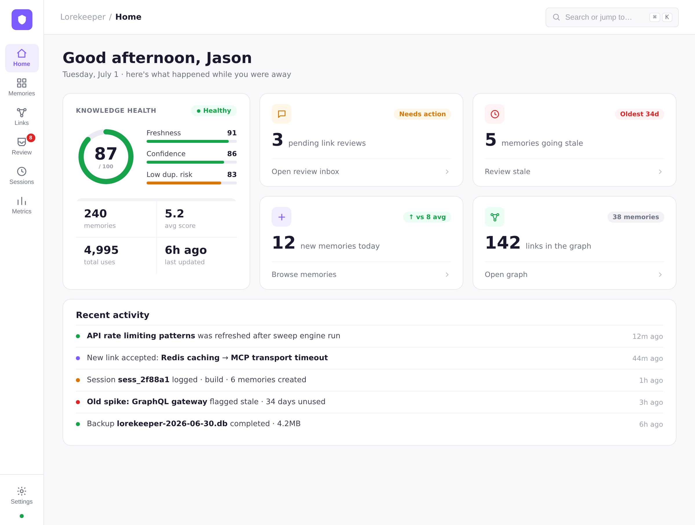

**Purpose:** daily digest — knowledge health at a glance + things that need the user's attention + a recent-activity log.

**Layout:**

1. Greeting header: "Good {time-of-day}, {user}" + today's date + "here's what happened while you were away".
2. Row: Knowledge Health card (fixed ~324px) beside a 2×2 grid of Stat Tiles:
   - Pending link reviews → routes to Review (Suggestions tab).
   - Memories going stale → routes to Review (Stale tab).
   - New memories today → routes to Memories (ideally pre-filtered to "today").
   - Links in the graph → routes to Links.
3. Recent Activity card: reverse-chronological list, each row = colored status dot + rich-text description (bold entity names) + relative timestamp. Event types seen: memory refreshed, link accepted, session logged, memory flagged stale, backup completed.

**Data needed:** a health/digest aggregate (composite score + freshness/confidence/dup-risk sub-scores + memory count/avg score/total uses/last-updated), the 4 stat counts, and a paginated/typed activity feed.

**Key interactions:** every health-card sub-metric and every stat tile is a navigation link elsewhere in the app — this page is a router disguised as a dashboard. The activity feed's click-through destinations aren't defined in the mockup; decide per event type (e.g. a "link accepted" row should probably open that link's detail drawer on the Links page).

### 3.2 Memories (`/memories`)

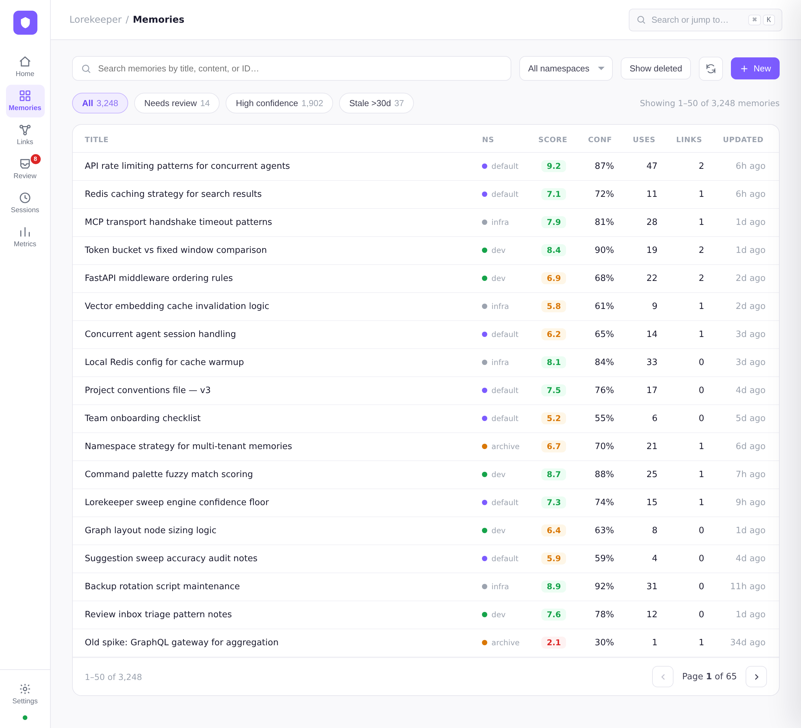

**Purpose:** the canonical browse/search/manage surface for all memories.

**Layout:** toolbar (search input, namespace filter, "Show deleted" toggle, refresh icon button, primary "New" button) → filter chip row (All / Needs review / High confidence / Stale >30d, each with a live count) → data table (Title, NS, Score, Conf, Uses, Links, Updated — all sortable) → pagination footer.

**Key interactions:** row click opens the Memory Detail Drawer in view mode; "Edit memory" flips it to edit mode in place. Filter chips and the namespace dropdown both act as query filters against the same underlying list.

**Gaps to close before build:** the "New" button and "Show deleted" toggle are toast-only stubs in the mockup — there is no composer screen designed for creating a memory, and no defined behavior difference for "deleted" rows in the table (grey out? separate badge?). Also, chip counts (3,248 / 14 / 1,902 / 37) must come from a server-side aggregate — the mockup fakes this by filtering ~18 hardcoded rows client-side, which will not work at 3,248+ real rows.

### 3.3 Links / Graph (`/links`)

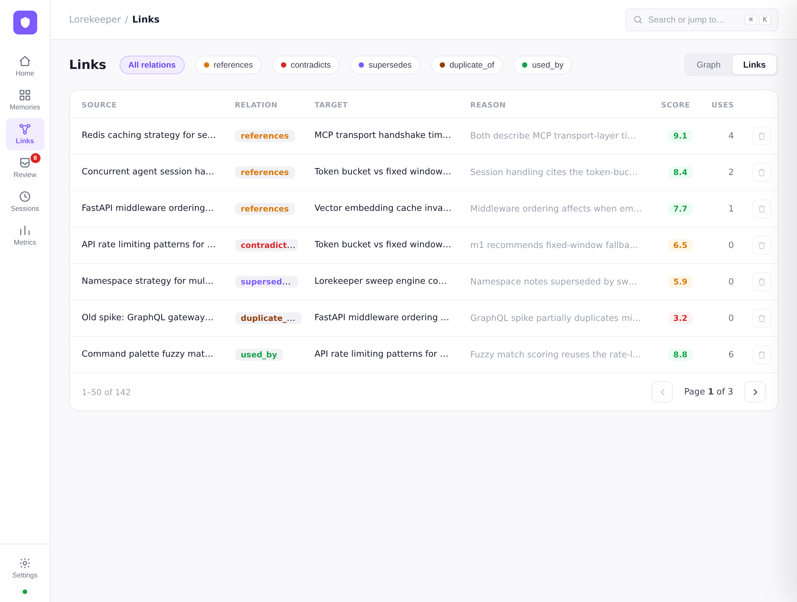

**Purpose:** explore and manage relationships between memories, either visually (graph) or as a flat, sortable, manageable list (table).

**Layout:** header with a relation-type legend/filter (also usable as the graph's edge filter) and a Graph/Links segmented toggle.

- **Graph view:** an SVG canvas of memory nodes (radius scales with score) connected by relation-colored edges. Click a node → dims everything except it and its direct connections, and populates a 300px side panel with that memory's title, ns/score chips, and a list of its direct connections (directional arrow + relation + other memory's title). Click empty canvas → clears the selection.
- **Table view:** sortable table (Source, Relation, Target, Reason, Score, Uses, delete icon). Clicking a source/target name or the row opens the Relationship Detail Drawer; the trailing delete icon opens the Confirm Dialog.

**⚠ Build note — graph layout is a placeholder:** the mockup positions nodes with a seeded pseudo-random jitter-grid (`mulberry32`), not a real force-directed layout, and has no pan/zoom/drag. It renders fine for ~18 nodes / ~7 edges of demo data. The real system has thousands of memories and hundreds of links — before building this for production, decide: (a) a real layout engine (e.g. force-directed, likely d3-force or similar), (b) pan/zoom/drag interactions, and (c) a strategy for graphs too large to render in full (clustering, "top N by centrality" default view, or requiring a namespace/relation filter before rendering). See [6.4](#64-graph-scalability).

### 3.4 Query (`/query`)

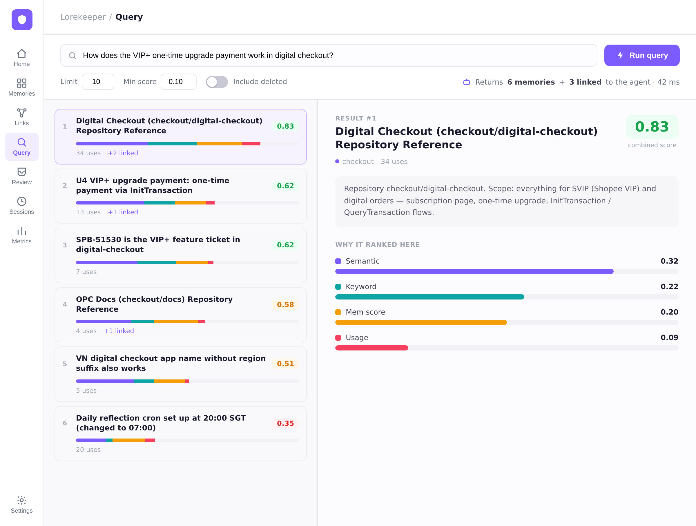

**Purpose:** an internal relevance-debugging tool for developers/support, not an end-user search box. It exposes the hybrid ranker's raw signal breakdown, which a normal search UI would hide.

**Layout:** composer bar (free-text query, "Run query" button, Limit, Min score, "Include deleted" toggle, and a live result summary "Returns N memories + M linked · Xms") → a 42%/58% split body: left = ranked result list (rank #, title, combined-score pill, a stacked bar of the 4 signal contributions, uses count, "+N linked" hint); right = an inspector for the selected result (title, ns/uses, big score badge, snippet, and a "why it ranked here" breakdown with one labeled progress bar per signal: Semantic, Keyword, Mem score, Usage).

**Key interaction:** selecting a left-list row updates the right inspector; the first result auto-selects on load.

**Notes for BE:** this page requires the search/ranking API to return the per-signal sub-scores (semantic, keyword, memory, usage) alongside the combined score — most product search endpoints wouldn't expose this by default, so treat it as a distinct "debug query" endpoint/response shape rather than reusing the palette's or Memories' search endpoint as-is.

### 3.5 Review Inbox (`/review`)

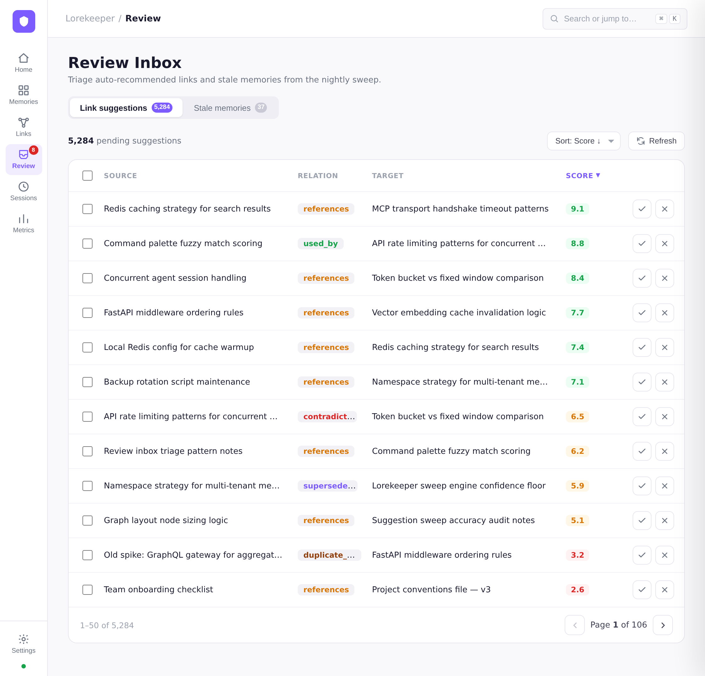

**Purpose:** triage queue for two independent things the sweep engine flags: pending auto-link suggestions, and memories going stale from disuse.

**Layout:** a segmented Suggestions/Stale toggle (each tab shows a live pending count as a badge) — each tab is its own bulk-selectable table (see 2.1 and 2.6) with a sort dropdown and, for suggestions, a refresh button.

- **Suggestions tab:** checkbox, Source, Relation, Target, Score, inline Accept/Reject icon buttons (immediate, no confirm). Row click opens the Relationship Detail Drawer with the same Accept/Reject actions.
- **Stale tab:** checkbox, Memory, NS, Score, "Last used Xd ago", inline Refresh + Delete. Row click opens the Memory Details drawer variant with Refresh/Delete actions.

**Key interactions:** bulk accept/reject/refresh/delete via the header action bar once rows are checked; per-row inline actions for one-off triage.

**Gaps to close before build:** the nav rail's Review badge shows a static "8" while this page shows 5,284 pending suggestions + 37 stale — define what subset of the queue the nav badge actually counts (e.g., only suggestions above some higher confidence bar, or a "new since last visit" count), since "8" clearly isn't "all pending." Also see [6.6](#66-inconsistent-confirmation-on-stale-delete) re: stale-delete missing a confirm step, and [6.8](#68-yn-keyboard-triage-not-implemented) re: keyboard triage shortcuts referenced in copy but not built.

### 3.6 Sessions (`/sessions`)

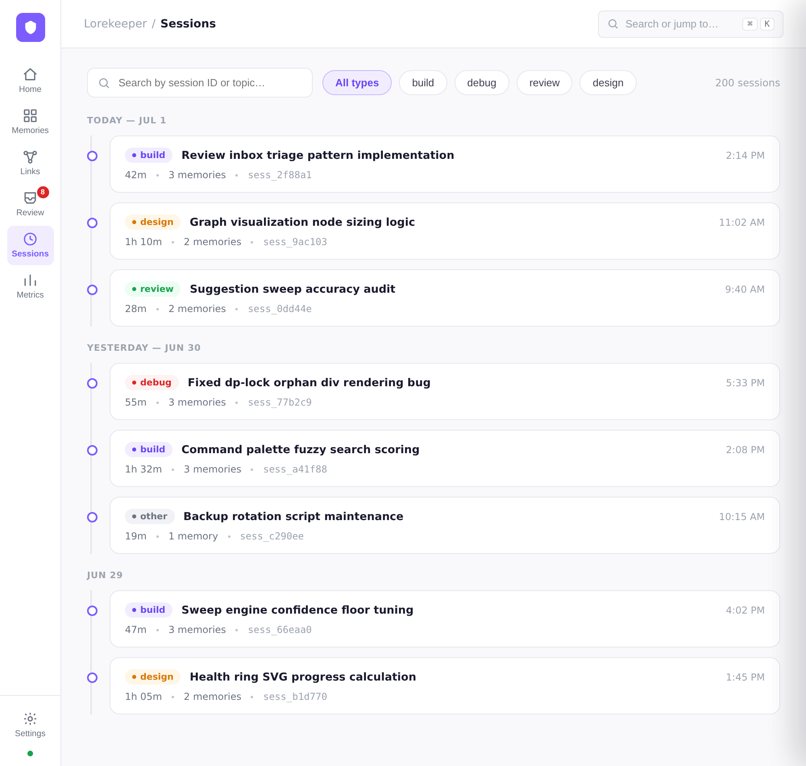

**Purpose:** a log of past agent work sessions and what memories each one produced.

**Layout:** search (by session ID or topic) + task-type filter chips (All/build/debug/review/design) + a day-grouped vertical timeline of session cards (task badge, title, time, duration, memory count, monospace session ID).

**Key interactions:** click a session card → Session Detail Drawer (title, meta chips, session ID, summary, and a list of memory cards created in that session). Click a memory card inside that drawer → opens the shared Memory Detail Drawer (2.2-A) layered on top, same component and behavior as on the Memories page. Empty state: "No sessions match this filter."

**Data needed:** sessions (id, task type, topic, start time, duration, memory count, summary) plus, per session, the list of memories it created (title, short description, score).

### 3.7 Metrics (`/metrics`)

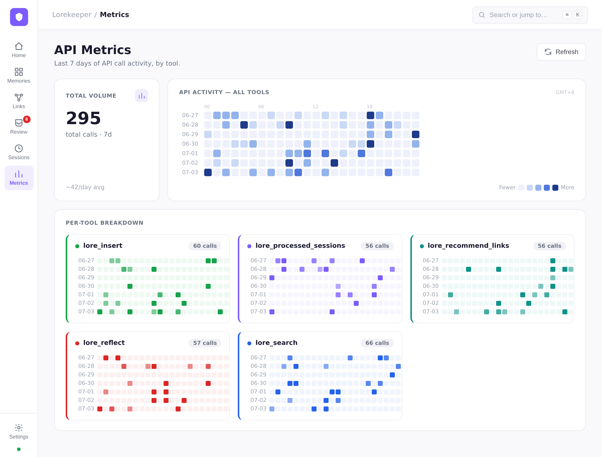

**Purpose:** operational visibility into MCP tool call volume over the trailing 7 days.

**Layout:** header + Refresh → Total volume card (7d total + avg/day) beside a day×hour heatmap (hover tooltip: date/hour, per-tool counts, total) → a per-tool breakdown grid, one card per tool (lore_insert, lore_processed_sessions, lore_recommend_links, lore_reflect, lore_search), each with a colored accent border, a total-calls badge, and its own mini heatmap.

**Notes for BE:** needs an hourly, per-tool call-count aggregation over 7 days. The mockup hardcodes a "GMT+8" label on the heatmap and generates random demo data client-side — confirm the real timezone behavior (fixed server tz vs. user-local) and wire this to an actual tool-call log aggregate.

### 3.8 Settings (`/settings`)

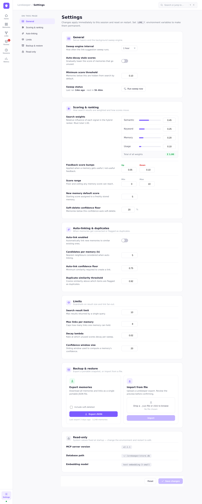

**Purpose:** tune the sweep engine, ranking weights, auto-linking thresholds, and limits; back up/restore data.

**Layout:** sticky left side-nav (General / Scoring & ranking / Auto-linking / Limits / Backup & restore / Read-only) with scroll-spy highlighting, next to a single scrolling content column containing all sections. A sticky bottom save bar shows an "Unsaved changes" indicator plus Reset/Save buttons once any field changes.

**Sections:**

- **General** — sweep interval (select), auto-decay toggle, minimum score threshold, sweep status + "Run sweep now".
- **Scoring & ranking** — 4 search-weight inputs (Semantic/Keyword/Memory/Usage) each paired with a bar, plus a live "Σ total" badge that flags red when weights don't sum to 1.00; feedback score bumps (up/down); score range (min/max); new-memory default score; soft-delete confidence floor.
- **Auto-linking & duplicates** — auto-link enabled toggle, candidates-per-memory (k), auto-link confidence floor, duplicate similarity threshold.
- **Limits** — search result limit, max links per memory, decay lambda, confidence window size.
- **Backup & restore** — export tile (include-soft-deleted checkbox, "Export JSON" button, last-export metadata) and import tile (drag-and-drop `.json`, a preview diff of what will be inserted/skipped before a confirm-style "Import" button).
- **Read-only** — server version, DB path, embedding model (display-only, monospace).

**Key product decision to confirm:** the page copy states changes "apply immediately to this session and reset on restart" unless the equivalent `LORE_*` environment variable is set — i.e., these settings are **not** meant to persist to a database by default. Confirm this is really the intended model before building persistence; it changes the API shape substantially (a runtime-config endpoint vs. a settings table).

### 3.9 Command Palette (global)

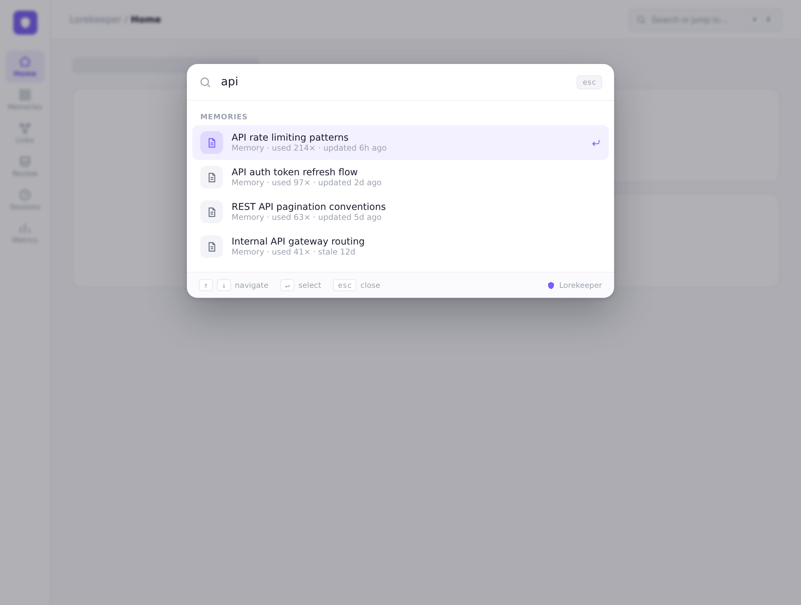

See [2.9](#29-command-palette) — this "page" is really an overlay, not a route.

---

## 4. Cross-Cutting Interaction Rules

These apply across every page — treat them as house rules, not per-page decisions:

1. **Destructive actions confirm; reversible/lightweight actions don't.** Hard-delete-memory and delete-link always show the Confirm Dialog. Soft-delete, accept/reject a suggestion, and stale refresh/delete fire immediately with a toast. (Exception found in the mockup, flagged in 6.6.)
2. **Score coloring is global and consistent** — red/amber/green thresholds (2.3) apply anywhere a 0–10 score renders, in tables, pills, and drawers alike. Don't let a page invent its own thresholds.
3. **Namespace and relation colors are global enums** — the same 4 namespace colors and 5 relation colors (2.4, 2.5) must be used everywhere those values appear, so a user can pattern-match by color across pages.
4. **Row-level action buttons stop propagation.** Any icon/button inside a clickable table row must not also trigger the row's own click handler.
5. **Drawers can stack.** Design z-index layering so a second drawer (e.g. a memory opened from within a session) sits above the first, and closing it reveals the first drawer intact underneath, not the base page.
6. **Bulk selection replaces the header caption, not the whole toolbar.** When rows are checked, only the count/label area swaps to a contextual action bar — sort/refresh controls stay in place.
7. **Every filterable/sortable list needs an explicit empty state.** Don't ship a "0 results" blank table.
8. **Toasts are transient and singular** in the current design — decide early if bulk operations need a different (queued or count-summarized) feedback pattern instead of one message per batch.

---

## 5. Inferred Data Model & API Surface

Derived from field usage across the mockups. **Labeled inferred/proposed — validate names and shapes with BE/product before treating as final**, especially the endpoint paths, which are guesses except where the mockup literally references one (`/api/export`).

### 5.1 Entities

- **Memory** — `id`, `title`, `description`, `content`, `namespace` (`default` \| `dev` \| `infra` \| `archive`, possibly extensible), `score` (0–10), `confidence` (0–100%), `uses` (int), `links` (int, denormalized count), `updated_at`, `created_at`, `deleted_at` (soft delete).
- **Session** — `id`, `task_type` (`build` \| `debug` \| `review` \| `design` \| `other`), `topic`/`title`, `started_at`, `duration`, `memory_count`, `summary`, `memories[]` (refs to memories created in-session, each with a short per-session description and score).
- **Link** — `id`, `source_memory_id`, `target_memory_id`, `relation` (`references` \| `contradicts` \| `supersedes` \| `duplicate_of` \| `used_by`), `reason`, `score`, `uses`, `status` (`pending` \| `accepted` \| `rejected` — suggestions are likely just links with `status=pending`), `created_at`.
- **Settings** — one config object: `sweep_interval`, `auto_decay_enabled`, `min_score_threshold`, `w_semantic`, `w_keyword`, `w_memory`, `w_usage`, `feedback_bump_up`, `feedback_bump_down`, `score_min`, `score_max`, `new_memory_default_score`, `soft_delete_confidence_floor`, `auto_link_enabled`, `auto_link_k`, `auto_link_confidence_floor`, `duplicate_similarity_threshold`, `search_result_limit`, `max_links_per_memory`, `decay_lambda`, `confidence_window_size`.
- **MetricEvent** — `tool_name` (`lore_insert` \| `lore_search` \| `lore_reflect` \| `lore_recommend_links` \| `lore_processed_sessions`), `timestamp`, `count`.
- **HealthSnapshot** — `composite_score`, `freshness`, `confidence`, `dup_risk_score`, `memories_count`, `avg_score`, `total_uses`, `last_updated_at`.

### 5.2 Proposed endpoints

```
GET    /api/memories?q=&namespace=&status=&sort=&page=      list + filters
GET    /api/memories/:id
PATCH  /api/memories/:id
POST   /api/memories/:id/soft-delete
DELETE /api/memories/:id                                    hard delete, confirm-gated in UI
GET    /api/memories/stale?sort=&page=
POST   /api/memories/:id/refresh                            mark "used" today

GET    /api/links?relation=&sort=&page=
DELETE /api/links/:id

GET    /api/suggestions?sort=&page=
POST   /api/suggestions/:id/accept
POST   /api/suggestions/:id/reject
POST   /api/suggestions/bulk-accept   { ids: [] }
POST   /api/suggestions/bulk-reject   { ids: [] }

GET    /api/sessions?q=&task=&page=
GET    /api/sessions/:id

POST   /api/query   { q, limit, min_score, include_deleted } → ranked results with per-signal scores

GET    /api/metrics/tool-calls?range=7d
GET    /api/health                                          Home digest aggregate

GET    /api/settings
PUT    /api/settings

POST   /api/export     { include_deleted }
POST   /api/import/preview   (file) → diff counts
POST   /api/import/confirm

POST   /api/sweep/run
```

---

## 6. Open Questions / Gaps (resolve before or during build)

### 6.1 Nav rail inconsistencies

The 9 mockup files don't agree on the nav rail: Home labels the third item "Graph" while every other page labels the same slot "Links"; the Query page's rail is missing the Review unread badge and the bottom health-status dot, and inserts Query as an extra 7th destination that no other page includes at all; Command Palette's rail has no Query entry either. **Resolve to one canonical 7-item list (Home, Memories, Links, Query, Review, Sessions, Metrics + Settings) and apply it identically everywhere.**

### 6.2 Review nav badge semantics

Nav shows a static "8" for Review; the Review page itself shows 5,284 pending suggestions and 37 stale memories. Define what the badge actually counts (a high-priority subset? new-since-last-visit? something else) — it is clearly not "all pending items."

### 6.3 Pagination contract

Every table mockup only hydrates page 1 with real data (Memories: 3,248 rows, Links: 142, Suggestions: 5,284, Stale: 37, but only ~12–18 sample rows exist in the mock). Confirm page size (50 appears to be the standard), whether pagination is offset- or cursor-based, and whether filter chip counts (e.g. "Needs review 14") come from a server aggregate rather than client-side filtering of a loaded page.

### 6.4 Graph scalability

See [3.3](#33-links--graph-links) — the graph view's layout algorithm, and its ability to render/interact with a production-sized graph, is undesigned. Needs a decision before FE starts on the graph canvas.

### 6.5 Missing "New memory" composer

The Memories page has a "New" button with no corresponding screen anywhere in v7. Needs a design pass (modal? drawer? dedicated page?) before FE can build it — currently a toast-only stub.

### 6.6 Inconsistent confirmation on stale-delete

Every other permanent-delete action in the app (hard-delete memory, delete link) confirms first. The Stale tab's row-level "Delete" button in the mockup deletes immediately with no confirmation — the one exception to the house rule in [4.1](#4-cross-cutting-interaction-rules). Recommend aligning it to require confirmation like the others, unless product intentionally wants stale-memory deletes to be low-friction.

### 6.7 Score-threshold inconsistency

Amber/red boundary for the score pill differs between Sessions (`≥4` amber) and every other page (`≥5` amber). Pick one (recommend `≥5`) and standardize.

### 6.8 Y/N keyboard triage not implemented

Two separate pieces of seed content ("Review inbox triage pattern notes") describe Y/N keyboard shortcuts cutting triage time from ~9s to ~3s per item — but the actual Review page markup has no keyboard handling at all, only click targets. Decide whether this is in scope for v7 or a future iteration; if in scope, it belongs on both the Suggestions and Stale tables.

### 6.9 Settings persistence model

Confirm whether Settings really should be session-scoped/ephemeral (per the on-page copy) or whether product wants it persisted — this materially changes the backend design (runtime config service vs. a settings table + migration).

### 6.10 Weight-sum validation strictness

Scoring weights show a live "Σ total" badge that turns red when weights don't sum to 1.00, but nothing in the mockup blocks Save when it's red. Decide if this should be a hard validation (block save) or a soft warning (allow save, just flag it).

### 6.11 Command Palette backing search

The palette currently filters a small hardcoded list client-side. Production needs it backed by a real endpoint (pages + a memory/action search) — likely worth reusing the Query page's ranking, though Query's response shape (with per-signal breakdowns) is almost certainly overkill for the palette's needs.

### 6.12 Timezone handling

Metrics heatmap hardcodes a "GMT+8" label. Confirm whether this should reflect the user's local timezone or a fixed org/server timezone.

### 6.13 "Today" / digest window definition

Home's "new memories today" stat and greeting subcopy ("here's what happened while you were away") imply a defined digest window. Confirm whether "today" is the user's local calendar day or a rolling 24h window, and what "away" is measured against (last login? last active session?).

### 6.14 Home activity feed click-through

Activity feed rows on Home aren't wired to anything in the mockup. Define a destination per event type (e.g., a "link accepted" event should plausibly open that link's detail drawer on the Links page).

---

## 7. Suggested Build Sequence

1. **Shared shell** — nav rail (resolved per 6.1), top bar, Command Palette shell (can stub its data source initially).
2. **Shared components** — data table w/ sort + pagination, both Detail Drawer variants, Confirm Dialog, Toast, chip/segmented control, Score Pill / Namespace Dot / Relation Pill.
3. **Memories** — exercises table + memory drawer + filters + pagination end-to-end; resolve 6.3 and 6.5 here.
4. **Sessions** — reuses the memory drawer from step 3; adds the stacked-drawer pattern.
5. **Review Inbox** — reuses the table + bulk-select pattern + relationship drawer; resolve 6.6 and 6.8 here.
6. **Links/Graph** — table view first (cheap, reuses existing patterns), then the graph canvas once 6.4 is resolved.
7. **Home** — mostly aggregation of data already exposed by steps 3–6; resolve 6.13 and 6.14.
8. **Metrics** — self-contained, lowest cross-page risk; resolve 6.12.
9. **Settings** — self-contained; resolve 6.9 and 6.10 before wiring Save to a real backend.
10. **Command Palette (real backend)** — swap the stub for a real search/command endpoint once Memories/Sessions/Review/Links APIs exist; resolve 6.11.

---

## 8. Design Tokens (reference)

| Token             | Value                                                             | Usage                           |
| ----------------- | ----------------------------------------------------------------- | ------------------------------- |
| App background    | `#f9f9fb`                                                         | page canvas                     |
| Text primary      | `#1a1a2e`                                                         | headings, primary text          |
| Text body         | `#3f3f52`                                                         | body copy                       |
| Text muted        | `#6b7280`                                                         | secondary labels                |
| Text faint        | `#9ca3af` / `#c2c2cf`                                             | micro-labels, placeholders      |
| Border            | `#e6e6ee`                                                         | card/input borders              |
| Divider           | `#eeeef3` / `#f1f1f6`                                             | row/section dividers            |
| Brand / accent    | `#7c5cff`                                                         | primary actions, active states  |
| Accent hover text | `#6a46f5`                                                         | active chip/link text           |
| Accent tint bg    | `#f1edff`                                                         | active chip/nav background      |
| Success           | `#16a34a` on `#ecfdf3`                                            | positive pills, accept actions  |
| Warning           | `#d97706` on `#fef6e7`                                            | mid-range pills, caution        |
| Danger            | `#dc2626` on `#fef2f2`                                            | destructive actions, low scores |
| Card radius       | `14px`                                                            | cards                           |
| Control radius    | `8–9px`                                                           | buttons, inputs                 |
| Pill radius       | `999px`                                                           | chips, badges                   |
| Font              | system stack (`-apple-system, "Segoe UI", system-ui, sans-serif`) | all text                        |
| Base body size    | `13px`                                                            | table/body text                 |
| Micro-label size  | `11px`, uppercase, `0.04–0.06em` tracking                         | section/column labels           |

---

_This document was reverse-engineered from the v7 prototype markup (`.dc.html` files with embedded demo logic and seeded random data). Where the prototype's demo behavior and a sane production behavior diverge, this doc calls it out explicitly rather than treating the demo as spec — see Section 6 before assuming any interaction is final._
